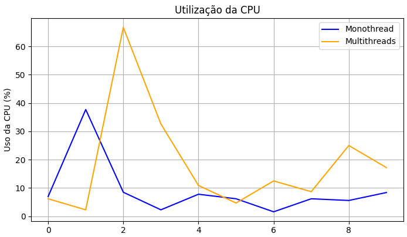

# Desempenho no Processamento de Imagens: Abordagem Sequencial e com Threads

Este repositório demonstra a diferença de desempenho entre o processamento de imagens, gerando imagens com filtro blur, usando uma abordagem **sequencial** e uma abordagem com **threads**. Os testes são realizados em dois conjuntos de dados:

- **smaller_DB**: Contém 3 imagens para testes mais rápidos.
- **bigger_DB**: Contém 595 imagens para um teste de desempenho mais significativo.

## Estrutura do Projeto

```bash
|--- bigger_DB/
|   |--- images/
|   |   |--- inputs/         # 595 imagens originais
|   |   |--- outputs/        # imagens desfocadas
|   |--- plot_time-cpu.py    # código que gera um gráfico de comparação de desempenho
|   |--- sequential_blur.py  # tempo de processamento sequencial
|   |--- threading_blur      # tempo de processamento utilizando threads
|--- smaller_DB/
    |--- images/
    |   |--- inputs/      # 3 imagens originais
    |   |--- outputs/     # imagens desfocadas
    |--- plot_time-cpu.py    # código que gera um gráfico de comparação de desempenho
    |--- sequential_blur.py  # tempo de processamento sequencial
    |--- threading_blur      # tempo de processamento utilizando threads  sequencial
```

## Bibliotecas Utilizadas

O projeto utiliza as seguintes bibliotecas:

- threading: Para criar e gerenciar threads.

- PIL (Pillow): Para processamento de imagens.

- time: Para medir o tempo de execução.

- os: Para manipulação de arquivos e diretórios.

- psutil: Para monitorar o uso da CPU.

- matplotlib: Para geração de gráficos.

## Comparação de Desempenho

Abaixo estão gráficos que ilustram a diferença de desempenho entre as abordagens **sequencial** e com **threads**, com base no tempo de execução para ambos os conjuntos de dados.

### Gráfico de Tempo de Processamento

- smaller_DB


- bigger_DB


### Gráfico de Uso da CPU

- smaller_DB



- bigger_DB


Como podemos ver nos gráficos, o uso de threads reduz significativamente o tempo de processamento. Além disso, o gráfico de uso da CPU mostra que, com threads, o uso do processador é mais eficiente, enquanto no processamento sequencial ele tende a subutilizar os recursos.
