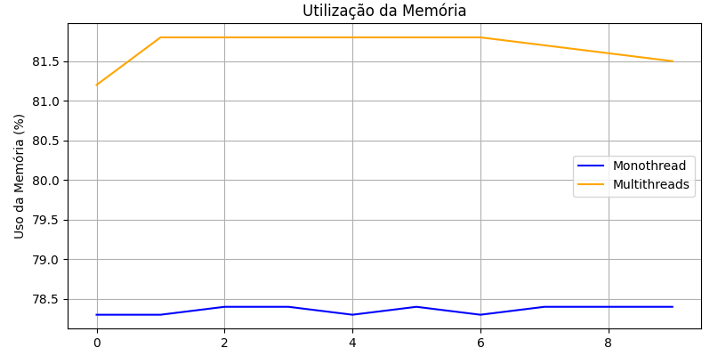

# Desempenho no Processamento de Imagens: Abordagem Monothread e Multithreads

Este repositório demonstra a diferença de desempenho entre o processamento de imagens, gerando imagens com filtro blur, usando abordagem **monothread** e uma abordagem **miltithreads**. Os testes são realizados em dois conjuntos de dados:

- **smaller_DB**: Contém 3 imagens para testes mais rápidos.
- **bigger_DB**: Contém 595 imagens para um teste de desempenho mais significativo.

## Estrutura do Projeto

```bash
|--- bigger_DB/
|   |--- images/
|   |   |--- inputs/         # 595 imagens originais
|   |   |--- outputs/        # imagens desfocadas
|   |--- plot.py    # código que gera um gráfico de comparação de desempenho
|   |--- monothread_blur.py  # tempo de processamento monothread
|   |--- multithread_blur.py # tempo de processamento multithreads
|--- smaller_DB/
    |--- images/
    |   |--- inputs/      # 3 imagens originais
    |   |--- outputs/     # imagens desfocadas
    |--- plot.py    # código que gera um gráfico de comparação de desempenho
    |--- monothread_blur.py  # tempo de processamento monothread
    |--- multithread_blur.py # tempo de processamento multithreads
```

## Bibliotecas Utilizadas

O projeto utiliza as seguintes bibliotecas:

- threading: Para criar e gerenciar threads.

- PIL (Pillow): Para processamento de imagens.

- time: Para medir o tempo de execução.

- os: Para manipulação de arquivos e diretórios.

- psutil: Para monitorar o uso da CPU.

- matplotlib: Para geração de gráficos.

## Comparação de Desempenho

Abaixo estão gráficos que ilustram a diferença de desempenho entre as abordagens **monothread** e **multithreads**, com base no tempo de execução para ambos os conjuntos de dados.

### bigger_DB

#### Gráfico de Tempo de Processamento


#### Gráfico de Uso da CPU


#### Gráfico de Uso de Disco


#### Gráfico de Uso da Memória



### smaller_DB

#### Gráfico de Tempo de Processamento


#### Gráfico de Uso da CPU


#### Gráfico de Uso de Disco


#### Gráfico de Uso da Memória


## Conclusão

Como podemos ver nos gráficos, o uso de multithreads reduz significativamente o tempo de processamento. Além disso, o gráfico de uso da CPU mostra que, com multithreads, o uso do processador é mais eficiente, enquanto no processamento monothread ele tende a subutilizar os recursos.

Em relação ao consumo de disco, não houve variação significativa, já que tanto na abordagem monothread quanto multithreads, as operações de leitura e escrita de arquivos ocorrem de forma semelhante, sendo o gargalo principal o processamento de imagens na CPU e não o acesso ao disco.

Quanto ao consumo de memória RAM, observou-se um aumento na implementação com multithreads. Isso ocorre porque, ao utilizar múltiplas threads, várias imagens são processadas simultaneamente, exigindo mais memória para armazenar dados temporários de cada thread em execução. Esse comportamento é esperado, pois cada thread pode carregar sua própria cópia de uma imagem ou parte do processamento, resultando em um uso mais intensivo de memória em comparação com a execução monothread, onde o processamento é feito uma imagem por vez.
